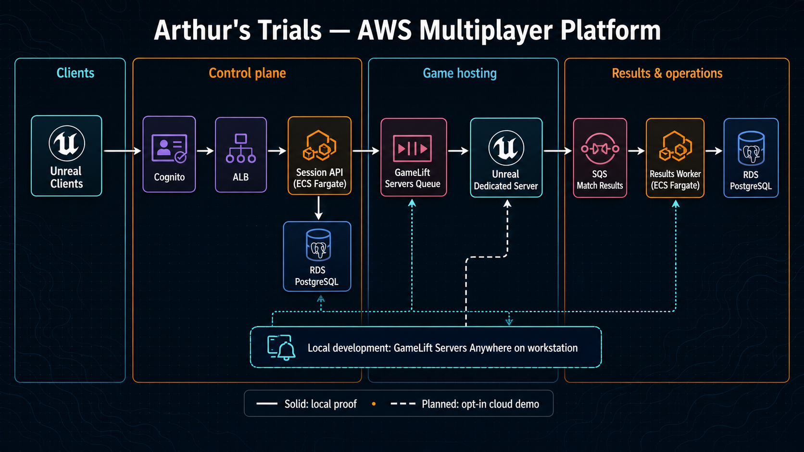
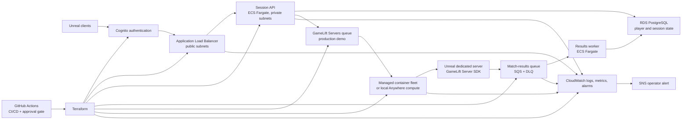

# Arthur's Trials — AWS Multiplayer Platform

**A cost-aware, production-shaped cloud/platform engineering case study.**

Arthur's Trials is a deliberately tiny 2–4 player Unreal Engine co-op vertical slice. The game is the workload, not the portfolio's whole story. The actual project is an AWS multiplayer platform: a secure web/API control plane, containerized dedicated servers, infrastructure as code, automated delivery, observability, reliability experiments, and a measured scaling model.

Amazon GameLift Servers is the distinctive hosting layer, but it is only one part of the system. A cloud or platform interviewer should be able to discuss the project through familiar concerns—VPC design, public and private subnets, ALB, ECS/Fargate, RDS, Terraform, Docker, ECR, IAM, APIs, asynchronous processing, CI/CD, dashboards, alarms, capacity, failure recovery, and cost controls—without needing to be a game developer.

The project starts with local multiplayer and an Amazon GameLift Servers Anywhere fleet, then supports a short, deliberately time-boxed managed-cloud demonstration. It is designed so that the public portfolio shows real integrations and operational judgment without paying to keep a fleet running.

## What this should prove

- Unreal dedicated-server integration with the GameLift Servers Server SDK lifecycle.
- Secure player authentication and session placement; clients never receive AWS credentials.
- A two-AZ VPC with a public Application Load Balancer and private ECS/Fargate session API and results worker.
- Cognito, RDS PostgreSQL, SQS, and a dead-letter queue for an explicit, idempotent match-results workflow.
- Dockerized Linux server images in ECR and GameLift Servers managed container fleets as the cloud target.
- Terraform modules, remote state, repeatable builds, and CI/CD with tests, plans, protected deployment approval, and release evidence.
- Operational readiness: structured logs, dashboards, CloudWatch-to-SNS alarms, a runbook, graceful shutdown, and controlled failure tests.
- A defensible scale path from a local four-player match to regional, multi-region hosting.
- Practical FinOps: every resource is tagged, managed capacity is opt-in, and teardown is part of the demo.

## Portfolio claim

> Designed a production-style AWS multiplayer platform around a 4-player Unreal dedicated-server workload, using Terraform, VPC networking, containerized ECS and GameLift Servers workloads, RDS, asynchronous match-result processing, CI/CD, observability, and demand-based scaling.

Only completed items will be represented as implemented. The scale design will be labelled as a tested design, planned architecture, or measured result as appropriate.

## Build plan

The detailed build order, acceptance criteria, cost guardrails, and platform capability matrix are in [the portfolio blueprint](docs/PORTFOLIO_BLUEPRINT.md).

For an honest, evidence-based view of what works today versus what remains a
planned production design, see the [implementation status](docs/IMPLEMENTATION_STATUS.md).

The GameLift player-session admission control has been tested with both a valid
credential and a rejected missing credential; see the [redacted local proof](docs/evidence/LOCAL_PLAYER_SESSION_PROOF.md).

The planned control-plane trust boundary and session handoff are specified in
the [session API contract](docs/SESSION_API_CONTRACT.md).

The local, idempotent proof for the future asynchronous reward path is in the
[match-results contract](docs/MATCH_RESULTS_CONTRACT.md).

The deliberately narrow, repeatable local API performance check and its limits
are described in the [benchmark guide](docs/LOCAL_BENCHMARK.md).

A local, dependency-free implementation of that boundary lives in
[api/](api/README.md). It is tested with a fake adapter and can use the local
GameLift Anywhere fleet when explicitly configured; it is not deployed.
The full local API-to-GameLift-to-Unreal path is also
[runtime-verified with redacted evidence](docs/evidence/SESSION_API_ANYWHERE_PROOF.md).

The planned 60–90 second portfolio capture is in the
[demo video plan](docs/DEMO_VIDEO_PLAN.md).

The recording-friendly, sanitized local operations view is documented in the
[local operations dashboard guide](docs/LOCAL_OPERATIONS_DASHBOARD.md). It
derives evidence from a completed local proof; it is not presented as a
deployed CloudWatch dashboard.

For the safe, one-client local GameLift proof and a sanitized evidence export,
follow the [local runbook](docs/RUNBOOK.md).

The major cost, security, and delivery trade-offs are recorded in
[architecture decisions](docs/DECISIONS.md).

## Cost posture

- Develop and iterate with **GameLift Servers Anywhere** on the workstation.
- Keep managed-cloud resources disabled by default and deploy them only for a scheduled demo or test.
- Use one region and one tiny, short-lived fleet for the cloud proof; tear it down afterwards.
- Use AWS Budgets, mandatory cost tags, and CI policy checks before any managed deployment.
- Treat multi-region, Spot/FleetIQ, and large-load designs as architecture and simulation until there is a defined testing budget.

The Anywhere free tier currently includes 3,000 game-session placements and 500,000 server-connection minutes per month for the first 12 months. Verify account eligibility and current pricing before use: [AWS pricing](https://aws.amazon.com/gamelift/servers/pricing/anywhere-pricing/).

## Architecture in one view



The [default-off Terraform foundation](infra/README.md) validates the future
network, identity, and delivery-trust paths without creating cloud resources.
The [security and delivery foundation](docs/SECURITY_DELIVERY_FOUNDATION.md)
explains the Cognito and GitHub OIDC templates and their deliberately
permissionless/default-off boundary. The exact capture sequence for the
portfolio demo is in the [video plan](docs/DEMO_VIDEO_PLAN.md).

The included GitHub Actions workflow is a **validation-only** quality gate: it
tests the local API and proves the default Terraform plan contains no resources.
It has no AWS deployment step.

The session API also has a local Docker image and health endpoint. The
dedicated server is Windows/Anywhere runtime-tested and has also been packaged
for Linux, built into a local non-root container image, and smoke-tested on UDP
`7777`. The exact local artifact path and remaining cloud boundary are in the
[Linux server build plan](docs/LINUX_SERVER_BUILD_PLAN.md). The managed-container
input remains a validated, placeholder-only
[GameLift template](containers/server/gamelift-game-server-container.template.json).

Solid paths show the local proof already in place; dashed paths mark the
planned, opt-in managed-cloud demonstration.


## Local GameLift Anywhere development

The project includes a real Amazon GameLift Servers Anywhere development fleet
that uses the local PC as its compute. It has no managed EC2 capacity.

The local fleet configuration is intentionally untracked. Create it once from
the safe template and replace the placeholders with the values returned by the
GameLift setup script:

```powershell
Copy-Item ./scripts/GameLiftAnywhere.dev.example.psd1 ./scripts/GameLiftAnywhere.dev.psd1
```

From PowerShell:

```powershell
./scripts/Start-GameLiftAnywhereLocal.ps1
./scripts/New-GameLiftAnywhereSession.ps1
./scripts/New-GameLiftAnywherePlayerSession.ps1
./scripts/Stop-GameLiftAnywhereSession.ps1
```

The server requires a GameLift-issued player-session ID by default. The player
session helper represents the work that a production session API performs: it
reserves a player slot and returns a short-lived connection credential. Pass its
`PlayerSessionId` to the client without putting AWS credentials in the client:

```powershell
$player = ./scripts/New-GameLiftAnywherePlayerSession.ps1
& ./build/WindowsClient/ArthursTrials.exe "$($player.Address)?PlayerSessionId=$($player.PlayerSessionId)" -windowed -ResX=960 -ResY=540 -fps=30
```

For a strictly offline local-server check only, start the server with
`-DisablePlayerSessionValidation`. Do not use that flag for GameLift evidence or
portfolio demonstrations.

To completely remove the dev fleet and its custom location:

```powershell
./scripts/Remove-GameLiftAnywhereDev.ps1 -Confirm
# Recreate the location, fleet, and local compute after teardown.
./scripts/New-GameLiftAnywhereDev.ps1
```

The start helper requests a fresh short-lived compute token at launch and does
not save it to the repository.
