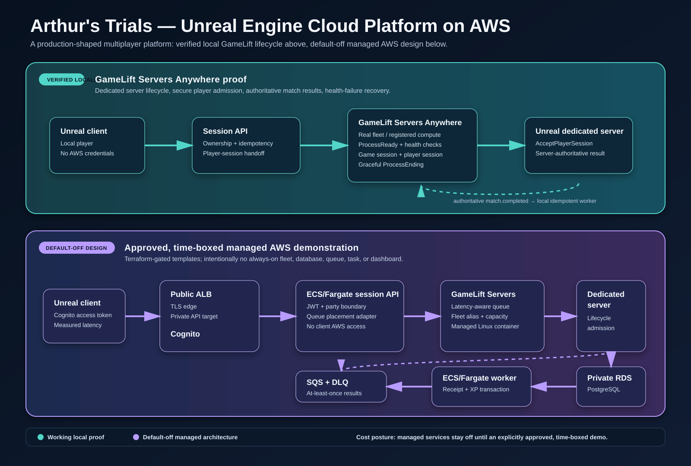

# Architecture visual

## Unified platform view

The primary visual shows the two workloads sharing a platform while preserving
the evidence boundary:

- Gaming is runtime-verified locally with GameLift Servers Anywhere. Its
  managed placement, data, and container path is default-off.
- Virtual production is workflow-verified locally through version, approval,
  rollback, and idempotent audit proofs. Its event-driven versioning and
  read-only stage-delivery path is default-off.
- The Unreal stage/render workstation remains local. AWS supports versioning,
  approval, recovery, and delivery around production—not the latency-sensitive
  LED-wall render loop.

No default-off component shown in purple is deployed. The normal Terraform
plan remains resource-free.

## Gaming detail

The diagram deliberately separates evidence from intent:

- The teal lane is working locally: Unreal client/server, GameLift Servers
  Anywhere lifecycle, player-session admission, health behavior, and
  authoritative local result processing.
- The purple lane is the default-off managed AWS design. Its Terraform,
  container, queue, worker, database, observability, and placement components
  are versioned and validated, but are not described as deployed until a
  separately approved, time-boxed test creates them.

This distinction is central to the portfolio claim. It demonstrates how the
platform fits together while preserving an honest boundary between local proof
and planned managed operation.
