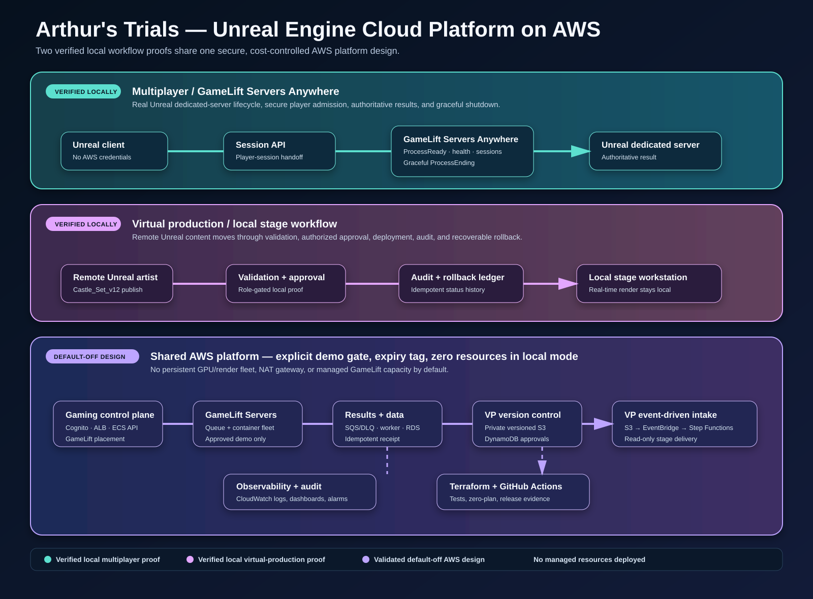

# Case study: Unreal Engine Cloud Platform on AWS

## The problem

A small game or virtual-production team needs cloud-platform practices without
the cost and operational burden of keeping game servers, databases, GPUs, or
render infrastructure running every day. The platform needs to prove that it
can safely operate a multiplayer session and govern production content, while
keeping the latency-critical Unreal stage local.

## The solution

Arthur's Trials combines two deliberately small Unreal workloads behind one
platform design:

| Workload | Local proof | Default-off AWS path |
| --- | --- | --- |
| Multiplayer game | Unreal dedicated server with the GameLift Servers Anywhere lifecycle, player-session admission, authoritative results, and clean termination | Cognito, private session API, GameLift queue/container fleet, SQS/DLQ results worker, RDS, CloudWatch, and Terraform-gated delivery |
| Virtual production | `Castle_Set_v12` progresses through upload, validation, authorized approval, local-stage deployment, audit, and rollback to retained `v11` | Private versioned S3 storage, DynamoDB approval metadata, EventBridge/Step Functions intake validation, stage read-only role, archive policy, and CloudWatch logs |

## What is proven today

- A locally running Unreal server initializes and terminates through the real
  GameLift Servers Anywhere SDK lifecycle.
- A GameLift-issued player-session credential is required before the server
  admits a client; the Unreal client never holds AWS credentials.
- The local match-results worker handles replay safely through an idempotency
  key, including retry and poison-message simulations.
- The virtual-production workflow tracks a concrete asset version, rejects an
  unauthorized approver, produces a stage approval for a production role,
  records audit status exactly once, and restores an earlier approved version
  while retaining the newer one.
- GitHub Actions tests these contracts, builds containers, validates Terraform,
  and proves the normal infrastructure plan has zero resource changes.

## Engineering decisions that matter

### The cloud is a control plane, not a render farm

The virtual-production stage/render workstation remains local. AWS handles
asset lifecycle, approval, recovery, and secure delivery around the stage.
This avoids claiming that a network hop can replace a latency-sensitive LED-wall
render loop, and it avoids an expensive persistent GPU fleet.

### Server authority is separate from player requests

The client requests a session but does not place fleets, determine results, or
hold AWS credentials. The dedicated server owns the match outcome; the results
worker owns durable progression updates.

### Version recovery is a product feature

The VP workflow treats `Castle_Set_v11` and `Castle_Set_v12` as recoverable
versions, not disposable build artifacts. A rollback switches the simulated
stage to a prior approved version and retains the newer version for audit and
later recovery.

### Cost control is designed in

Normal development uses a local GameLift Anywhere compute and local workflow
simulations. Terraform requires an explicit managed-demo mode, consent flag,
and expiry value before it can plan AWS resources. The infrastructure uses
serverless/on-demand services where sensible and deliberately does not create a
NAT gateway, GPU/render fleet, or always-on service in its default mode.

## Scale path

| Stage | Operating model | Evidence boundary |
| --- | --- | --- |
| Development | Local Unreal, GameLift Anywhere, deterministic workflow proofs | Runtime/workflow verified locally |
| Scheduled demo | One region, short-lived managed capacity and workflow services behind an explicit cost gate | Designed and Terraform-validated; not deployed yet |
| Production | Multi-location matchmaking, regional capacity, hardened approval identities, policy/governance, and recovery drills | Architecture direction, not a performance claim |

## Portfolio takeaway

This is not presented as a finished commercial game or a cloud-rendered stage.
It is a production-shaped platform case study demonstrating how an Unreal team
can keep delivery safe, recoverable, observable, and cost-aware across both
multiplayer gaming and virtual production.

For reproducible evidence, see the [implementation status](IMPLEMENTATION_STATUS.md),
[local GameLift runbook](RUNBOOK.md), and [virtual-production foundation](VIRTUAL_PRODUCTION_FOUNDATION.md).
